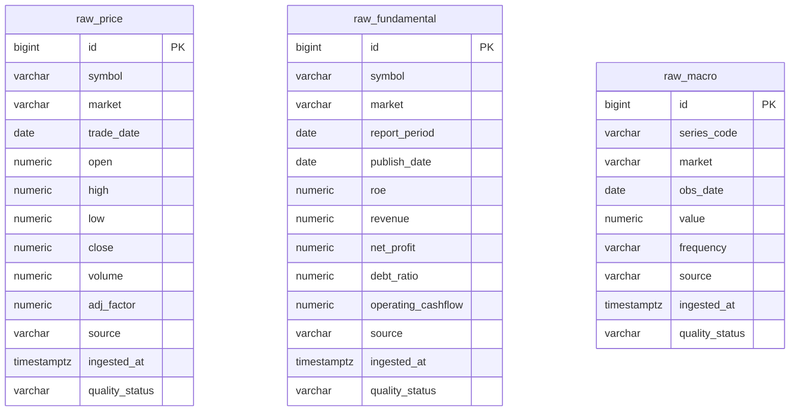

# ER Diagram (INV-31)

```mermaid
erDiagram
  raw_price {
    bigint id PK
    varchar symbol
    varchar market
    date trade_date
    numeric open
    numeric high
    numeric low
    numeric close
    numeric volume
    numeric adj_factor
    varchar source
    timestamptz ingested_at
    varchar quality_status
  }

  raw_fundamental {
    bigint id PK
    varchar symbol
    varchar market
    date report_period
    date publish_date
    numeric roe
    numeric revenue
    numeric net_profit
    numeric debt_ratio
    numeric operating_cashflow
    varchar source
    timestamptz ingested_at
    varchar quality_status
  }

  raw_macro {
    bigint id PK
    varchar series_code
    varchar market
    date obs_date
    numeric value
    varchar frequency
    varchar source
    timestamptz ingested_at
    varchar quality_status
  }
```
